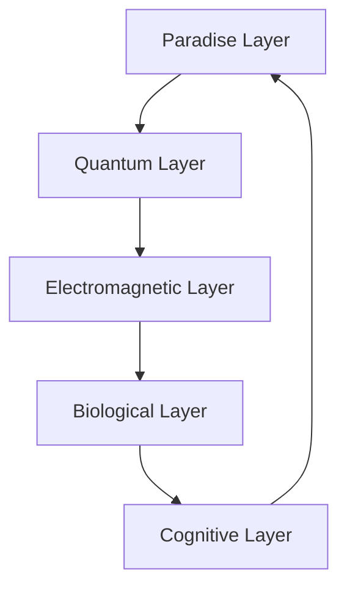

# PEFF Harmonization System
## Paradise Energy Fractal Force

PEFF is the fundamental force that aligns cognition, quantum coherence, and energy dynamics across nested reality layers in FractiVerse.

### Core Principles

1. **Paradise Particle System**
   ```python
   # Generate paradise particles
   particles = peff.paradise_generators[layer_idx](current_state)
   ```
   - Self-organizing energy units
   - Quantum coherence initialization
   - Fractal pattern alignment

2. **Harmony Scalar Fields**
   - Quantum Layer Harmonics
   - Electromagnetic Coherence
   - Biological Resonance
   - Cognitive Alignment

### Layer Integration



### Harmonization Process

1. **Energy Flow**
```python
# Apply PEFF harmonization
harmonized = peff.forward(
    input_state,
    target_layer=FractalLayer.QUANTUM,
    return_harmonics=True
)
```

2. **Coherence Control**
   - Stability monitoring
   - Pattern synchronization
   - Energy balance maintenance

3. **Cross-Layer Alignment**
   ```python
   # Measure harmony across layers
   harmony_scores = torch.stack([
       peff._measure_harmony(state) 
       for state in layer_states
   ])
   ```

### Integration Points

1. **UnipixelCore Integration**
   - Pattern processing
   - State harmonization
   - Reality channel alignment

2. **AIVFIAR Integration**
   - Reality stabilization
   - Quantum anchoring
   - Emotional matrix harmonization

3. **Network Integration**
   - Node synchronization
   - Bandwidth harmonization
   - Echo positioning alignment 