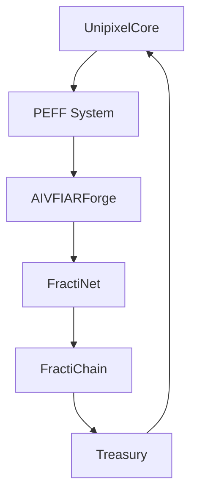

# FractiVerse System Architecture

## System Overview
FractiVerse implements a multi-layered, fractal-based architecture that enables recursive intelligence processing across different reality layers.

### Core Architecture Layers

1. **Cognitive Layer**
   ```
   UnipixelCore
   ├── Identity Layer
   ├── State Layer
   ├── Processing Layer
   └── PEFF Integration
   ```

2. **Reality Layer**
   ```
   AIVFIARForge
   ├── Pattern Generation
   ├── Emotional Matrix
   ├── Quantum Anchors
   └── Stability Control
   ```

3. **Network Layer**
   ```
   FractiNet
   ├── Echo Positioning
   ├── Bandwidth Control
   ├── Reality Channels
   └── Node Management
   ```

4. **Storage Layer**
   ```
   FractiChain
   ├── Memory Constellations
   ├── Pattern Storage
   ├── Blockchain Verification
   └── Reality Persistence
   ```

### System Integration



### Reality Channel Architecture
```
LinearVerse <--> FractiVerse <--> AIVFIAR
      ^             ^              ^
      |             |              |
   Standard     Fractal         Quantum
  Processing   Processing     Processing
``` 