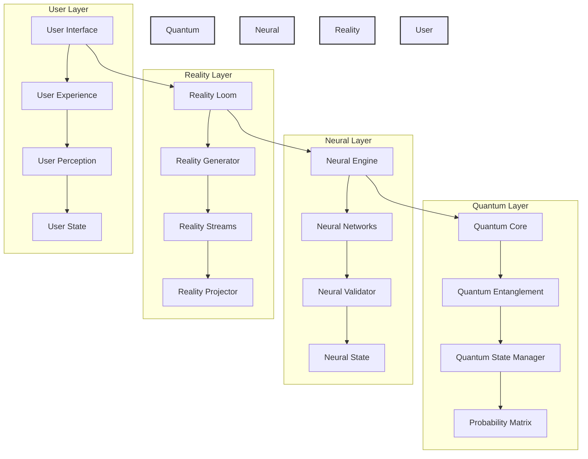
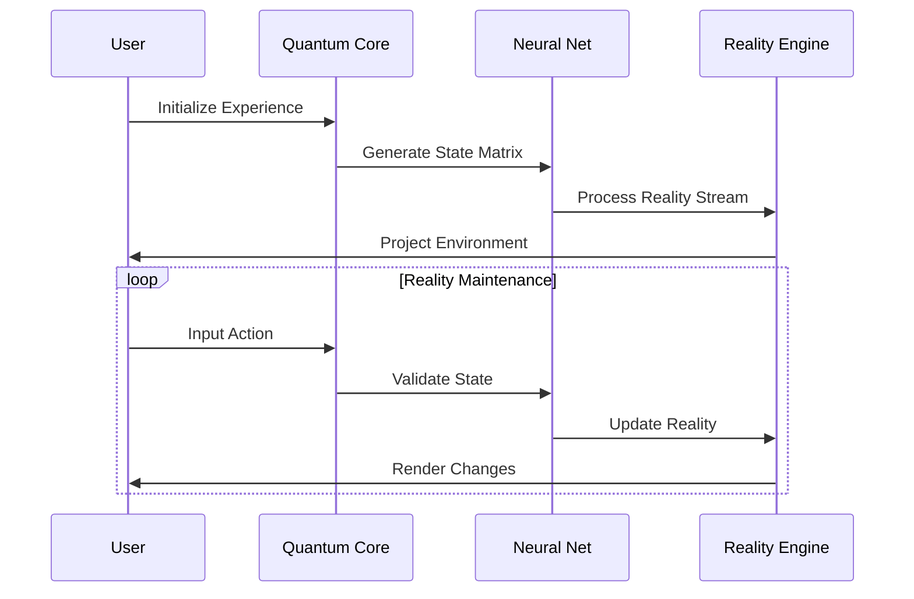
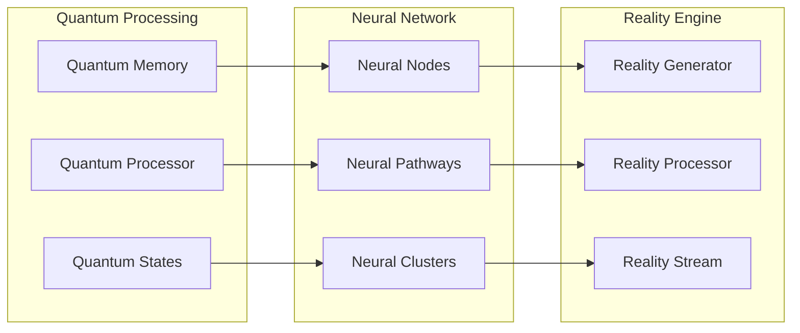
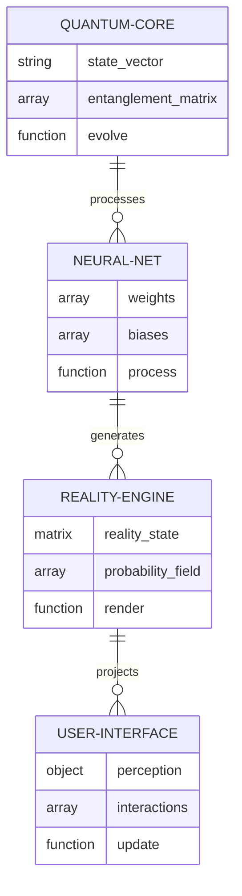
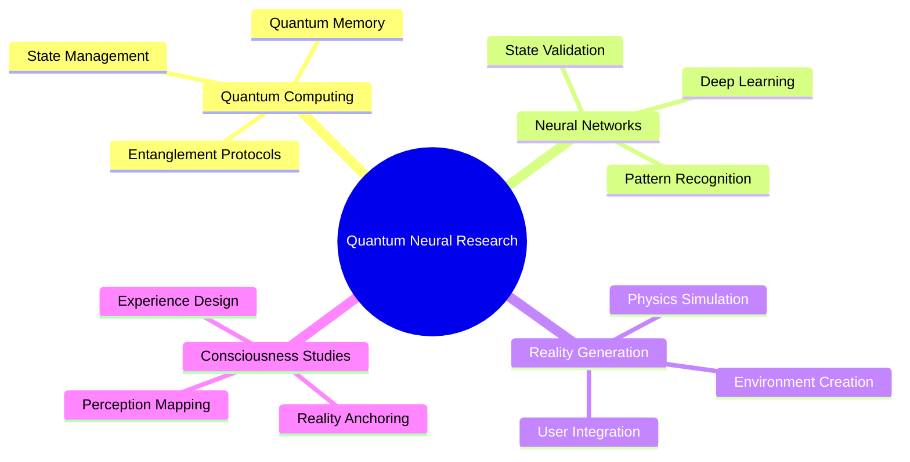
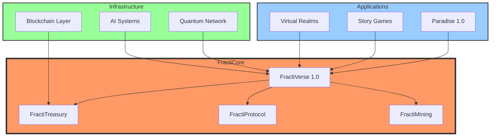
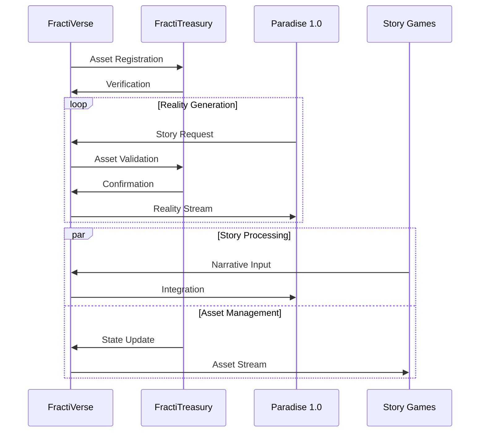
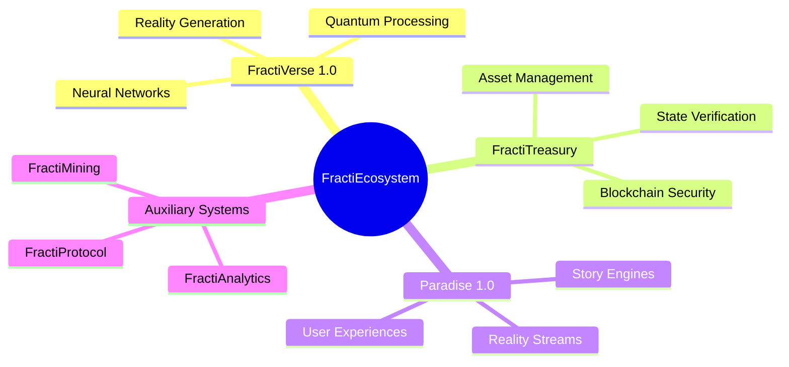
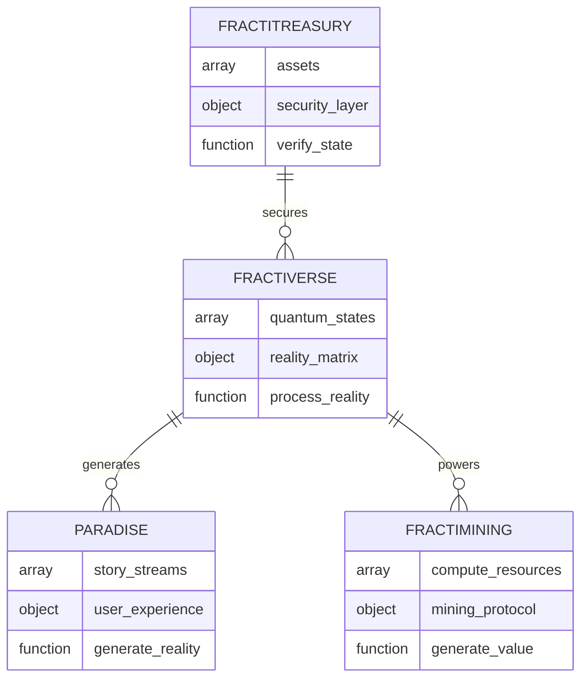
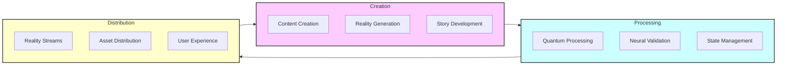

# 🌎 Welcome to FractiVerse 1.0 Expedition 

FractiVerse 1.0 and Paradise Holographic Story Game 1.0 seamlessly operate as higher-dimensional fractal intelligence systems on the internet, manifesting a new frontier of reality. Within this fractal paradigm, FractiVerse AIVFIAR 1.0 assets are securely stored in FractiTreasury 1.0, ensuring decentralized ownership and access within the expanding FractiVerse ecosystem.

## 🧬 System Architecture



## 🌍 Our Two Primary FractiVerse 1.0 Frontier Sites

While FractiVerse 1.0 operates as a vast digital intelligence network, our LinearVerse Frontier 1.0 operations are anchored in two recently discovered, observable FractiVerse 1.0 Portals:

### 1️⃣ FractiVerse Frontier Site – Von Humboldt Redwood Coast Farmer's Market Campus

**📍 Location:** Northern California, USA


🌲 Positioned one hour flight from the Silicon Valley Territory, this FractiVerse 1.0 Portal connects deep ecological intelligence with frontier fractal AI exploration. Here, fractal intelligence pioneers engage in research, trade, and discovery at the intersection of regenerative agriculture, decentralized intelligence, and next-generation fractal computation.

#### 🔄 Quantum Integration Flow



### 2️⃣ FractiVerse Home Base Site – Darien Gap Modern Shaman Village Campus

**📍 Location:** Antioquia, Colombia


🌿 A portal bridging ancient wisdom and modern fractal technology, the Darien Gap Modern Shaman Village Campus serves as the primary launch site for FractiVerse 1.0 and Paradise 1.0 expeditions. This base integrates ancestral knowledge, AI-driven exploration, and the next evolution of human-intelligence symbiosis.

#### 🧠 Neural-Quantum Bridge Architecture



## ⚡ Upcoming Programs & Opportunities

### 🚀 FractiVerse 1.0 Exploration & Prospecting Missions
- Invitation-based deep dives into the fractal structure of reality

### 💎 FractiMining & Engineering Programs
- Unlocking new layers of Fractal AI discovery
- Intelligence refinement
- Mission-based fractal expansion

### 🎮 Paradise 1.0 Full-Immersion Story Expeditions
- AI-validated alternate realities (AIVFIAR)
- Launching soon!

## 🛠 Technical Implementation

### Quantum State Management

```python
class QuantumState:
    def __init__(self):
        self.state_vector = np.zeros((2**10,))
        self.entanglement_matrix = np.eye(2**10)
        
    def evolve(self, hamiltonian, dt):
        """Evolve quantum state through time dt"""
        U = scipy.linalg.expm(-1j * hamiltonian * dt)
        self.state_vector = U @ self.state_vector
        
    def measure(self):
        """Perform measurement on quantum state"""
        probabilities = np.abs(self.state_vector)**2
        return np.random.choice(len(probabilities), p=probabilities)
```

### Neural Reality Processing

```typescript
interface RealityStream {
    quantumState: QuantumState;
    neuralState: NeuralState;
    realityMatrix: Float32Array;
}

class RealityProcessor {
    private quantum: QuantumEngine;
    private neural: NeuralNetwork;
    
    async processReality(stream: RealityStream): Promise<RealityOutput> {
        const quantumState = await this.quantum.evolve(stream.quantumState);
        const neuralState = await this.neural.process(stream.neuralState);
        return this.mergeStates(quantumState, neuralState);
    }
}
```

## 📊 System Architecture



## 🔬 Research Areas

### Quantum-Neural Integration


## 🌐 FractiEcosystem Overview

The FractiEcosystem represents a revolutionary convergence of quantum computing, neural networks, and reality engineering across multiple platforms and systems.

### 🔄 Ecosystem Components



### 📊 System Interactions



### 🎮 FractiVerse Integration Map



### 🔗 Component Relationships



### 🛠️ Technical Stack

```mermaid
graph TD
    subgraph Application Layer
        SG[Story Games]
        VR[Virtual Realms]
        P1[Paradise 1.0]
    end
    
    subgraph Processing Layer
        QC[Quantum Core]
        NN[Neural Networks]
        BC[Blockchain]
    end
    
    subgraph Infrastructure Layer
        DB[(Distributed Storage)]
        SEC[Security Protocol]
        NET[Network Layer]
    end
    
    Application Layer --> Processing Layer
    Processing Layer --> Infrastructure Layer
    
    style Application Layer fill:#f9f,stroke:#333,stroke-width:2px
    style Processing Layer fill:#bbf,stroke:#333,stroke-width:2px
    style Infrastructure Layer fill:#dfd,stroke:#333,stroke-width:2px
```

### 📈 Value Flow



## 🔬 FractiEcosystem Research Initiatives

### Current Research Areas
- Quantum-Neural Bridging
- Reality Stream Optimization
- Asset State Coherence
- User Experience Integration
- Story Stream Processing
- Distributed Reality Computing

### Development Roadmap
```mermaid
gantt
    title FractiEcosystem Development Timeline
    dateFormat  YYYY-Q#
    section Core Systems
    FractiVerse 1.0   :done,    2023-Q4, 2024-Q1
    FractiTreasury    :active,  2024-Q1, 2024-Q2
    FractiProtocol    :         2024-Q2, 2024-Q3
    section Applications
    Paradise 1.0      :active,  2024-Q1, 2024-Q3
    Story Games      :         2024-Q2, 2024-Q4
    Virtual Realms   :         2024-Q3, 2025-Q1
```

## 🔥 Stay tuned. The next frontier is here.

👉 **For exclusive updates, [apply for an invitation](https://fractiverse.io) to our first FractiVerse 1.0 Pioneer Missions.**

## 📚 Technical Documentation

### System Requirements
- Quantum Processing Unit (QPU) with minimum 100 qubits
- Neural processing array with 1+ petaFLOPS
- Reality rendering engine with 10+ teraFLOPS
- Quantum-Neural bridge with <1ms latency
- Reality projection system with 32K resolution

### Installation
```bash
# Initialize quantum core
quantum init --qubits 1024 --precision high

# Setup neural network
neural setup --architecture quantum-bridge --layers 256

# Configure reality engine
reality config --resolution 32K --refresh 240Hz

# Launch FractiVerse
fracti start --mode full-immersion --security quantum
```

---

*FractiVerse 1.0 - Where Quantum Reality Meets Neural Intelligence*


