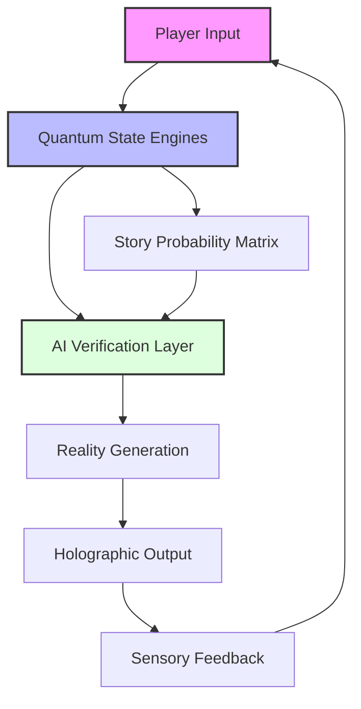
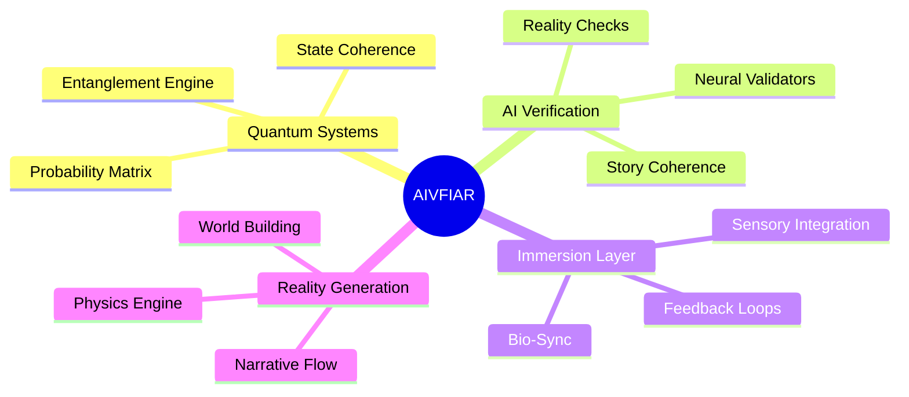
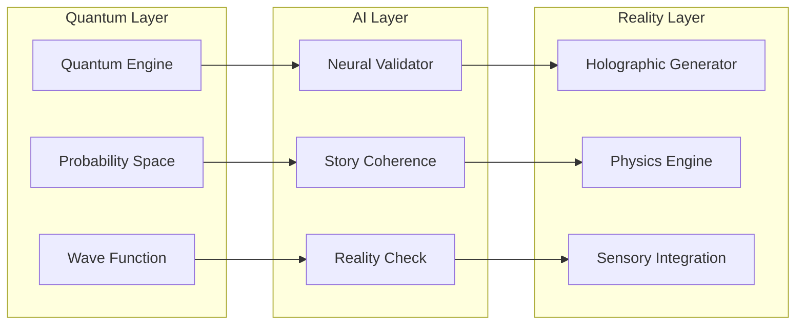
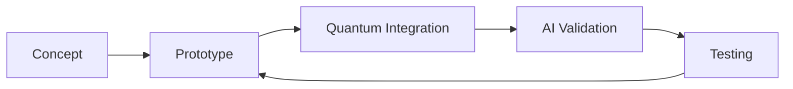
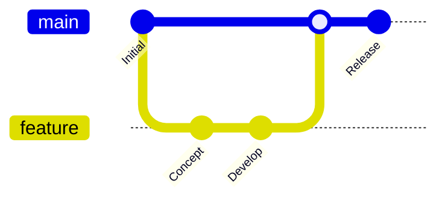

# 🌌 Quantum Holographic AIVFIAR Story Game - Set Design Documentation

> *Where quantum storytelling meets interactive holographic experiences*

## 🎯 Overview

Welcome to the set design documentation for our groundbreaking Quantum Holographic AI Verifiable Full-Immersion Alternate Reality (AIVFIAR) story game. This repository contains comprehensive documentation and resources for the environmental and spatial design elements that bring our quantum narrative to life.

### 🧬 AIVFIAR Meta-Paradigm

The AIVFIAR system represents a revolutionary approach to interactive storytelling:

- **AI Verifiable**: Neural networks validate and authenticate real-time story progression
- **Full-Immersion**: Complete sensory engagement through quantum-holographic interfaces
- **Alternate Reality**: Dynamically generated parallel story universes



## 🌟 Features

### Core AIVFIAR Components



- **Quantum-Inspired Environments**: Dynamic spaces that respond to narrative probability states
- **Holographic Integration**: Seamless blend of physical and digital reality layers
- **Interactive Set Elements**: Responsive environmental storytelling components
- **AI-Driven Adaptability**: Real-time set modifications based on player choices
- **Visual Fiction Framework**: Rich narrative-driven visual design system

## 🎨 Set Design Components

### Immersion Layers
| Layer | Function | Technology |
|-------|----------|------------|
| Quantum Base | Reality Foundation | Q-bit Processing |
| Neural Mesh | Story Validation | AI/ML Systems |
| Holographic | Visual Rendering | Light Field Tech |
| Sensory | Bio-Feedback | Neural Interface |

### Core Environments
- **Quantum Realm Interface**
  - Probability Wave Visualization
  - Quantum State Manipulation
  - Entanglement Nodes
- **Reality Nexus Hubs**
  - Story Convergence Points
  - Multi-verse Junctions
  - Timeline Bridges
- **Story Node Chambers**
  - Narrative Processing Units
  - Character Integration Zones
  - Plot Development Matrices
- **Player Interaction Zones**
  - Bio-Feedback Arrays
  - Neural Sync Stations
  - Reality Anchors

### Visual Language
- **Quantum State Indicators**
  ```
  ⟨ψ⟩ → |Story State⟩ = α|Path A⟩ + β|Path B⟩
  ```
- **Holographic Overlay Systems**
- **Environmental Storytelling Elements**
- **Dynamic Lighting Schemes**

## 🛠️ Technical Architecture



## 📝 Documentation Structure

```
set_design/
├── concepts/         # Concept art and visual development
│   ├── quantum/     # Quantum visualization designs
│   ├── neural/      # AI integration patterns
│   └── holo/        # Holographic projections
├── technical/        # Technical specifications
├── environments/     # Environment designs
├── interactions/     # Interactive elements
└── assets/          # Design resources
```

## 🔄 Development Workflow

### Iterative Reality Development


1. Concept Development
2. Technical Feasibility Assessment
3. Prototype Implementation
4. Integration Testing
5. Refinement and Optimization

## 🤝 Contributing

We welcome contributions from:
- Set Designers
- Visual Artists
- Technical Artists
- Quantum Computing Specialists
- AI/ML Engineers
- Narrative Designers

### Contribution Flow


## 📚 Version History

- v1.0 - Initial Release
  - Core environment framework
  - Basic quantum state integration
  - Preliminary holographic systems

## 📞 Contact

For questions or collaboration inquiries, please reach out to the development team.

---

*This project represents the convergence of quantum computing, artificial intelligence, and immersive storytelling, creating unprecedented narrative experiences through verified reality manipulation.*

> **Note**: All diagrams are generated using Mermaid.js and are viewable directly on GitHub.